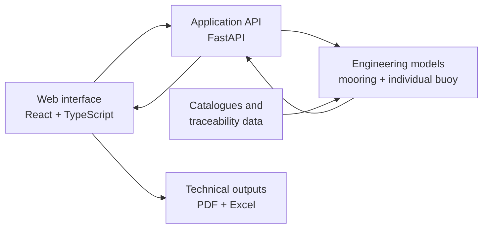

# Nautic Analytics

> Engineering software for preliminary mooring and buoy-system analysis.

**Work in progress · Active development · Not a released product**

**Source code: private**

Nautic Analytics brings mooring analysis and individual-buoy preliminary design into a local engineering application. It helps connect input assumptions, component choices and calculation results so that a proposed arrangement is easier to inspect, compare and explain.

The application is under active development in a private repository. This public showcase contains documentation only: there is no runnable application, installer or interactive demo here. Capabilities and engineering scope may change as development and validation continue.

## What I am building

The project brings the early engineering workflow into one local application:

- vessel and marine-environment definition;
- quasi-static environmental-load and mooring analysis;
- configuration-aware load sharing for single and multiple-buoy arrangements;
- component selection from buoy, chain, anchor and shackle catalogues;
- an individual-buoy workspace bringing requirements, geometry, buoyancy, component choices and preliminary structural review into one flow;
- utilization, sensitivity and alarm-curve views;
- PDF technical-report and Excel material-list exports;
- bilingual interface and reproducible local execution.

The mooring workflow evaluates vessel and environmental inputs. The individual-buoy workflow studies the buoy and its load path using supplied or declared actions; it does not independently establish the environmental design loads. Catalogue selections and computed proposals still require supporting capacity data and engineering review.

The engineering basis includes ROM and complementary international marine-engineering references. This showcase deliberately does not reproduce normative text, protected tables or project/client material.

## Why it exists

Preliminary engineering often becomes difficult to review when assumptions, calculations, component choices and report outputs live in separate places. Nautic Analytics is being shaped around three principles:

1. make assumptions visible;
2. keep calculation results traceable to the selected inputs and engineering rules;
3. make the result understandable before it becomes a detailed design package.

## Public project boundary

This repository contains presentation material only. It does not contain:

- the private application source code or compiled bundles;
- client names, project data or confidential deliverables;
- copied normative documents, tables or proprietary manufacturer material;
- credentials, deployment configuration or private engineering work products.

Examples and future screenshots will use synthetic or deliberately anonymized data.

## Architecture at a glance

The public abstraction is documented in [Architecture](docs/ARCHITECTURE.md).

## Current direction

- extending verification of the calculation models and their limits;
- making assumptions, missing evidence and review status clearer;
- refining the unified buoy-design workflow and its technical outputs;
- preparing shareable examples using synthetic data.

See the [roadmap](docs/ROADMAP.md) for the public project outline.

## Scope

Nautic Analytics is a **preliminary-design tool**. It is not a substitute for detailed dynamic analysis, fatigue assessment, geotechnical verification or review and sign-off by a qualified engineer.

Passing software tests or obtaining a favourable preliminary check does not certify a component, validate fabrication details or establish that a design is ready for construction. Connections, welds, local structural behaviour and declared component capacities require the appropriate independent evidence and assessment.

## En español

Nautic Analytics es una herramienta de ingeniería en desarrollo para el prediseño de sistemas de fondeo con boyas. Este repositorio público sirve como escaparate del proyecto: explica qué estoy construyendo, su arquitectura y su evolución, mientras el código fuente y la documentación de trabajo permanecen en un repositorio privado.

La aplicación reúne el análisis cuasiestático del fondeo y un espacio de trabajo de boya individual para estudiar requisitos, geometría, flotación y predimensionado estructural. Las comprobaciones preliminares y las pruebas del software no equivalen a certificación ni a autorización de fabricación. Este repositorio contiene únicamente documentación; no incluye una aplicación ejecutable ni una demo interactiva.

## About this repository

These four documents are curated in the private source repository and synchronized here automatically. Changes must be maintained in that curated source to survive subsequent publications. Application source contributions are not open at this stage.

Read the [architecture](docs/ARCHITECTURE.md), [development roadmap](docs/ROADMAP.md) and [public showcase notice](NOTICE.md) for the technical outline, current direction and publication boundary.
