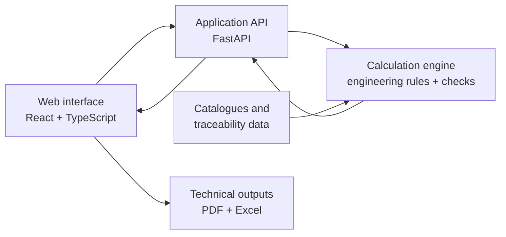

# Nautic Analytics

> Engineering software for preliminary mooring and buoy-system analysis.

**Status: active development · Source code: private**

Nautic Analytics is an engineering project for making the preliminary design of buoy-assisted mooring arrangements easier to inspect, compare and explain. The working source remains private while the product and its engineering basis are being developed; this repository is the public window into that work.

## What I am building

The project brings the early engineering workflow into one local application:

- vessel and marine-environment definition;
- quasi-static environmental-load and mooring analysis;
- configuration-aware load sharing for single and multiple-buoy arrangements;
- component selection from buoy, chain, anchor and shackle catalogues;
- utilization, sensitivity and alarm-curve views;
- PDF technical-report and Excel material-list exports;
- bilingual interface and reproducible local execution.

The engineering basis includes references from ROM 2.0-11, BS 6349-4, UFC, IACS and DNV. This showcase deliberately does not reproduce normative text, protected tables or project/client material.

## Why it exists

Preliminary engineering often becomes difficult to review when assumptions, calculations, component choices and report outputs live in separate places. Nautic Analytics is being shaped around three principles:

1. make assumptions visible;
2. keep calculation results traceable to the selected inputs and engineering rules;
3. make the result understandable before it becomes a detailed design package.

## Public project boundary

This repository contains presentation material only. It does not contain:

- the private application source code or compiled bundles;
- client names, project data or confidential deliverables;
- copied normative documents, tables or proprietary manufacturer material;
- credentials, deployment configuration or private engineering work products.

Examples and future screenshots will use synthetic or deliberately anonymized data.

## Architecture at a glance

The public abstraction is documented in [Architecture](docs/ARCHITECTURE.md).

## Current direction

- strengthening the calculation and regression-validation workflow;
- expanding traceability from input assumptions to engineering verdicts;
- improving the topology and catenary views;
- polishing technical-report and material-list exports;
- preparing a safe visual demo that does not expose the private implementation.

See the [roadmap](docs/ROADMAP.md) for the public project outline.

## Scope

Nautic Analytics is a **preliminary-design tool**. It is not a substitute for detailed dynamic analysis, fatigue assessment, geotechnical verification or review and sign-off by a qualified engineer.

## En español

Nautic Analytics es una herramienta de ingeniería en desarrollo para el prediseño de sistemas de fondeo con boyas. Este repositorio público sirve como escaparate del proyecto: explica qué estoy construyendo, su arquitectura y su evolución, mientras el código fuente y la documentación de trabajo permanecen en un repositorio privado.

## About this repository

This is a documentation-first showcase. The source repository is proprietary and is not open for cloning or code contributions at this stage. For the rationale behind this separation, see [NOTICE.md](NOTICE.md).
