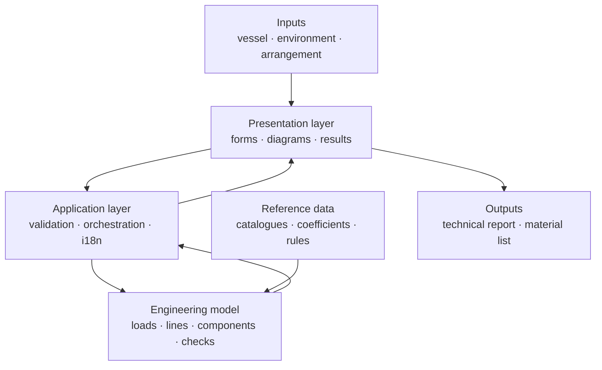

# Public architecture view

This page describes the product boundary without publishing implementation details.

## Design goals

### Explicit assumptions

Inputs such as vessel particulars, environmental conditions, arrangement and component declarations remain visible in the workflow. The aim is to make a result reviewable rather than merely numerical.

### Separation of concerns

The interface presents the calculation; the application layer validates and orchestrates it; the engineering model owns the calculations; reference data remains distinct from presentation code.

### Traceable results

Results are intended to carry enough context to explain the governing condition, the selected component and the limitation of the check. A verdict is not treated as a replacement for engineering judgement.

### Private implementation, public communication

The public repository documents the product shape and engineering intent. The implementation, private test corpus and detailed working documents remain in the private repository.

## Technology direction

- Backend: FastAPI and Python.
- Frontend: React, TypeScript, Vite and D3-based diagrams.
- Runtime: local web application with technical exports.
- Engineering basis: ROM, BS, UFC, IACS and DNV references selected for the relevant preliminary checks.
