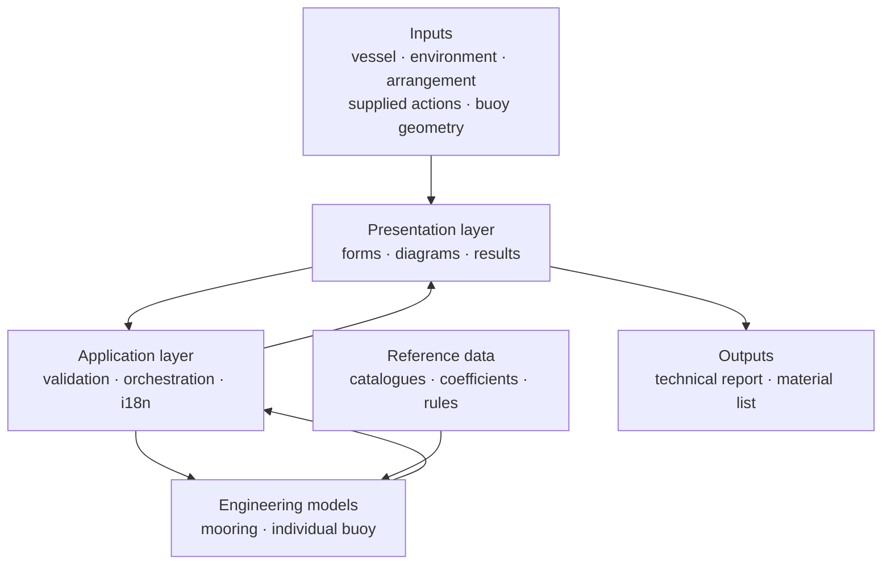

# Public architecture view

This page describes the private application's conceptual structure. It is not an API specification or a deployment guide; this repository contains presentation documents only.

[Project overview](../README.md) · [Roadmap](ROADMAP.md) · [Notice](../NOTICE.md)

The arrows describe the user-facing flow, not the location of every implementation step. Technical outputs present the evaluated inputs, results and limitations for review.

## Two engineering workflows

| Workflow | Inputs and purpose | Boundary |
| --- | --- | --- |
| Mooring analysis | Vessel, environment and arrangement inputs support quasi-static loads, line behaviour and component checks. | Detailed dynamics, fatigue and site geotechnics require separate assessment. |
| Individual-buoy design | Supplied actions, geometry and material assumptions support buoyancy, component choices and preliminary structural assessment. | The workspace does not independently establish environmental actions or certify component capacities and fabrication. |

The buoy workspace brings preliminary selection and editable engineering detail into one interface. A proposal and an evaluated detail are separate working revisions: changing the proposal does not automatically validate or replace an existing engineering assessment.

## Design goals

### Explicit assumptions

Inputs such as vessel particulars, environmental conditions, arrangement and component declarations remain visible in the workflow. The aim is to make a result reviewable rather than merely numerical.

### Separation of concerns

The interface presents the calculation; the application layer validates and orchestrates it; the engineering model owns the calculations; reference data remains distinct from presentation code.

### Traceable results

Results are intended to carry enough context to explain the governing condition, the selected component and the limitation of the check. A verdict is not treated as a replacement for engineering judgement.

Declared capacities, calculated demands and preliminary sizing must remain distinguishable. Missing evidence and checks outside the model's scope must remain visible rather than being interpreted as successful verification.

### Verification and engineering validation

Regression tests help detect software changes; analytical checks help assess mathematical consistency. Neither alone establishes physical validity, certified capacity or construction readiness. Independent review, suitable reference cases and the relevant test or manufacturer evidence remain part of engineering acceptance.

### Private implementation, public communication

The public repository documents the product shape and engineering intent. The implementation, private test corpus and detailed working documents remain in the private repository.

## Technology direction

- Backend: FastAPI and Python.
- Frontend: React, TypeScript, Vite and D3-based diagrams.
- Runtime: local web application with technical exports.
- Engineering basis: ROM and complementary international marine-engineering references selected for the relevant preliminary checks.
